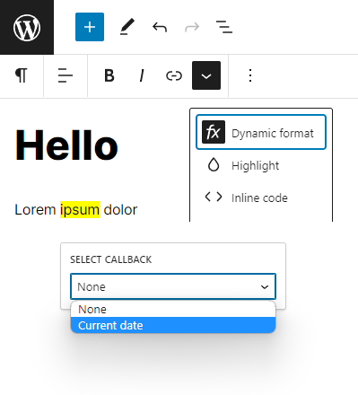

# WordPress Dynamic Format

This WordPress plugin adds a dynamic [format](https://developer.wordpress.org/block-editor/how-to-guides/format-api/) which renders an output of a selected php callback function added via a [filter hook](https://developer.wordpress.org/plugins/hooks/filters/).



## Usage

Add callback functions via `piotrpress/dynamic_format/callbacks` filter:

```php
add_filter( 'piotrpress/dynamic_format/callbacks', function( array $callbacks ) : array {
    $callbacks[ 'Current date' ] = fn( string $content ) : string => date( 'Y-m-d H:i:s' );
    return $callbacks;
} );
```

or if you would like to translate the label:

```php
add_filter( 'piotrpress/dynamic_format/callbacks', function( array $callbacks ) : array {
    $callbacks[ 'current_date' ] = [
        'label' => __( 'Current date', 'textdomain' ),
        'value' => fn( string $content ) : string => date( 'Y-m-d H:i:s' );
    ];
    return $callbacks;
} );
```

## Requirements

PHP >= `7.4` version.

## License

[GPL v3 or later](license.txt)